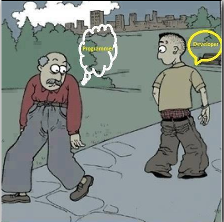
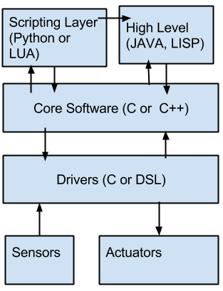

.. Robotic Vision documentation master file, created by
   sphinx-quickstart on Sat Dec 28 15:11:23 2013.
   You can adapt this file completely to your liking, but it should at least
   contain the root `toctree` directive.

.. image:: weebly.png
    :height: 250
    :width: 1300
    
Foundation Course
======================
Foundation Course is an initiative from `Masters of Autonomous Systems, Hochschule Bonn-Rhein-Sieg`_.
The primary motive of this one month foundation course is to lay a foundation for the Master course ahead.
The foundation course aims at the following :

* Getting used to Ubuntu as OS.
* Familiarity with languages such as C, C++, Python,Octave and JAVA.
* Time Management.
* Documentation and Presentation with Latex.
* Software Documentation with Sphinx and Doxygen.
* Basic mathematical concepts.
* Software Design Patterns.
* Basic Programming Concepts.
* ROS as a framework.
* Software versioning such as GIT, SVN and Mercurial.

By end of the foundation, participants are expected to do a group project.
All the queries and discussions regarding the Foundation Course should take place in this `forum`_ .
The reason for having an open forum is all benefit from individuals question. The forum is only meant for technical discussions.

.. todo:: Time table

.. toctree::
   :maxdepth: 6

Getting Started
-----------------

Laptop/Desktop : Consider your laptop as an investment rather than an expenditure. The time you save with a
good laptop is enormous. Consider the below as a minimum configuration::

	 Processor : i3 or above.
	 RAM : 4 GB or above.
         Hard Disk : 250 GB or above (Consider more if you want dual boot with windows).
	 Graphics Card : NVIDIA 640 or above (Dedicated RAM of more than 1GB is preferable).
         Equivalent RADEON processors can also be used.

Operating System
******************

*Ubuntu users can ignore this part*

.. image:: ubuntu.jpeg
    :height: 100

Ubuntu has been the favourite OS for couple of years. All the development of Robocup takes place in Ubuntu 
and ROS framework is closely associated to Ubuntu. Currently the version that is being used is `Ubuntu 12.04`_
(LTS). Ubuntu is always versioned as xx.yy where xx is the year of release and yy is the month. Ubuntu releases
twice in a year. Once in April and once in October. xx.04 and yy.10. We insist that you have a native OS rather than
a virtual box or wubi. Please allocate more than 100GB when you partition your disk for native installation.

First Steps
~~~~~~~~~~~~~~~
Once the OS is installed, please try using terminal. Download the :download:`manual <manual.pdf>` and get started.
Try using terminal to create folders, create edit and remove files etc.  Try all the commands in the :download:`cheatsheet <cheatsheet.pdf>` 
and get familiarized. 

Advanced Set-Ups
~~~~~~~~~~~~~~~~~~~

In order to install any software, you can either install the binaries directly or build the source and install yourself.

* If you install through binaries, you have to find the equivalent package name and install it::

	sudo apt-get install *package_name*

* If you wish to install through source, you need to download the source, build it and install it. As a example::

	git clone *source link*
	mkdir build && cd build
	cmake .. 
	make
	sudo make install

The method of building differs. Building and installing instructions are usually present in the README or INSTALL file.

Software Updates
~~~~~~~~~~~~~~~~~
For the foundation course we need the following softwares to be installed::

	sudo apt-get install kile texlive-full git subversion mercurial

* kile - IDE for Latex documentation.
* texlive-full - Documentation Libraries for Latex.
* git, subversion and mercurial are used for software versioning. GIT will be used more extensively.

Finally install ROS as per the instructions provided in `ROS Hydro`_ . Do not follow the ROS tutorials 
at this stage.

.. role:: red

**It is completely fine if at this stage you are not able to understand what you do. It will be clear during
later part of the foundation course**

Mathematical Basics
--------------------
Robotic Application demands basic knowledge of Mathematics. There are few courses which are based upon the 
foundation of Mathematics. 

Linear Algebra
****************

* A system is said to be linear if its *mathematical* model can be expressed as a linear equation.
* Linear systems are compartively easy to solve than non-linear systems.
* When is a system said to be linear ??  
	* When you can express the system as::
		
		Ax = B
* Linear Algebra teaches us to solve for *x*.
* Some concepts that will be covered in Foundation Course are as follows :
	* What is a Matrix ?
	* Matrix Properties.
	* Matrix Computations.
	* Matrix Determinant.
	* Singularity of a Matrix.
	* Eigen Values.
	* Different ways of finding inverse of a matrix.

* Demonstration ::

	A demonstration will be shown in image processing where the application of what we learnt in Linear Algebra is put to test.
	This will also be one of the student project for the Foundation Course.

Frames
**********

* Since we are familiar with Matrix at this point of time, understanding of frames is easier.
* Concepts convered :
	* What are frames ?
	* Where do we attach them ?
	* Homogenous Matrix and Transform.
	* Quaterniouns.
	* Euler Angles.
* Reference : :download:`Introduction to Robotics <craig.pdf>`

* Demonstration ::

	Task Frame Formulation where the task can be dictated to robot as frames.
	This will also be one of the student prjoect for the foundation course. 

Probablity & Statistics
***********************

* Till now, we have captured only deterministic systems. Deterministic Systems do not capture noise in the system.
* Probability allows us by introducing variance in the results.
* In the foundation course we will focus on :
	* High school probablity and statitics.

Programming Concepts
---------------------

Image Courtesy : `web_image`_

During the course of Autonomous Systems, it is expected that students learn programming languages in order to
demonstrate the implemented algorithms. Programming and Development are two different aspects.
Prototyoing plays an important role, where you do not want to spend time in "developing" software which
you are not sure of its functionality. In such cases, we strongly recommend to go for prototyoing softwares
such as Matlab, Octave, Python or Lua. Software Development is an art of keeping the software maintainable and
keeping it open for future changes and adaptation. Software Design Patterns guide us in achieving such kind of 
maintainability.

You as a software architect, based upon your experience and guidelines, should find which pattern is useful for the
problem that you have in hand.

Programming Styles -OOP
*************************

Software Architecture and Design
*********************************

UML
************

Software Design Patterns
*************************

State Machines
******************

Communications
*****************
In the Foundation Course, we shall implement different ways of communication based on ZeroMQ .

.. raw:: html
	
	<iframe src="http://www.slideshare.net/slideshow/embed_code/10420545" width="427" height="356" frameborder="0" marginwidth="0" marginheight="0" scrolling="no" style="border:1px solid #CCC;border-width:1px 1px 0;margin-bottom:5px" allowfullscreen> </iframe> 
 <strong> <a href="https://www.slideshare.net/pieterh/overview-of-zeromq" title="Overview of ZeroMQ" target="_blank">Overview of ZeroMQ</a> </strong> from <strong><a href="http://www.slideshare.net/pieterh" target="_blank">pieterh</a></strong> 

Multi-threading
********************

Shared Memory
*******************

Database
*************

Understanding ROS
******************

Algorithms and Data-structures
------------------------------

Basic Data Structures
**********************

Stacks and Queues
********************

ROS Message
*******************

Point Cloud
************

Protbuf
*********

Control Systems
--------------------

Classical Control Theory
**************************

Closed-loop transfer function
~~~~~~~~~~~~~~~~~~~~~~~~~~~~~~

PID controller
~~~~~~~~~~~~~~~~~

Modern Control Theory
***********************

.. _forum: http://mas-brsu.1002603.n3.nabble.com/
.. _Ubuntu 12.04: http://releases.ubuntu.com/precise/
.. _ROS Hydro: http://wiki.ros.org/hydro/Installation/Ubuntu
.. _Masters of Autonomous Systems, Hochschule Bonn-Rhein-Sieg: http://www.inf.fh-bonn-rhein-sieg.de/informatik/en/MAS.html
.. _web_image: http://www.procalculus.com/fth/view.php?picture=129
